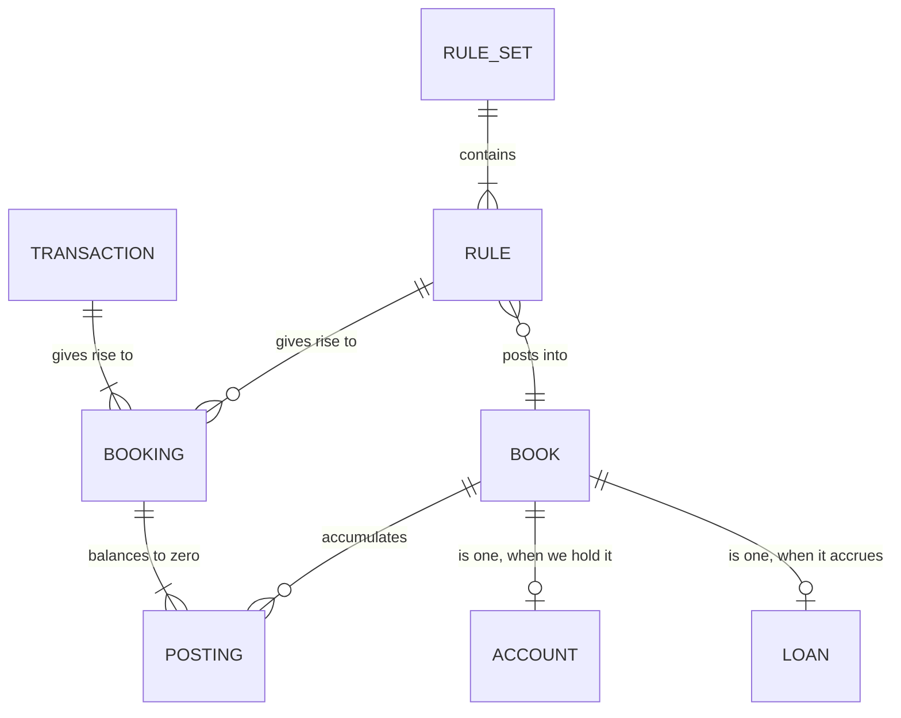

# Books

What a category actually is, and why the ledger is about to be described in
terms of books and postings. Written before the code, so the reasoning survives
the implementation.

This describes a model being **moved to**, not the one in place. See
[#108](https://github.com/madmacfrosty-org/tightarse/issues/108) for the work.

Examples are invented. Merchants are real household data and
[do not go in files](../../CONTRIBUTING.md#this-repository-is-public).

## The problem

Money the household did not spend is counted as spending, and money it owes is
not counted at all.

A loan repayment leaves the current account, so it is spend. It is not — most of
it retires a debt, and only the interest is a cost. The same is true of anything
moved to an account we do not hold: savings elsewhere, an unconnected card, money
lent to a person.

Today the only thing excluded from a total is a **detected transfer**, which
pairs a debit in one account against a credit in another. Both sides have to be
in the ledger. When the other side is an account we do not hold, there is nothing
to pair with, and the money reads as gone.

The obvious remedy does not work either. `CategoryKind` exists, describes itself
as "the only thing code may branch on… because totals depend on it", and nothing
branches on it: `summarise` never receives the catalogue. Marking a category as a
movement changes no figure.

## The model

Every transaction has two sides. One is the bank account it crossed. The other is
whatever it was for — and **that is what categorising records**. Filing something
as Groceries says its other side went to the Groceries book.

So the second posting already exists. Every categorisation is one. What has never
existed is a balance for those books.

**Book** — a named place postings accumulate. A bank account is a book; so is a
category; so is a loan.

**Posting** — one side of one movement: an amount into a book, effective when the
money moved, recorded when we decided it belonged there.

**Booking** — the postings that must balance to zero. A transaction arriving is a
booking of two: the account, and the book named by the provider's own category. A
rule firing is another: out of that book, into ours.

**Transaction** — the bank's fact. It gives rise to bookings; it is not one.

**Account** and **Loan** are what a book additionally *is*, when it is one.
Neither is a separate thing to post against.

## Position and flow are the same arithmetic

A book's **position** is the running sum of its postings. Its **flow** between two
dates is the difference between the positions at those dates.

Groceries has a position — everything ever spent on food — and a flow, what was
spent in March. A loan has a position, what is owed, and a flow, what was repaid
in March. There is no second kind of book.

One property separates them, and it is a flag rather than a taxonomy: **does this
book's position roll up into the household total?** Bank accounts yes. A loan
yes, negatively. Savings held elsewhere yes. Groceries no — its position is a
real number and it is not part of what you are worth.

That flag is what `CategoryKind` was reaching for and did not reach.

It also collapses two computations into one. `summarise` produces flows per
category over a range; `netPositionSeries` produces levels per account over time.
Both are running sums over books, asked different questions.

## Nothing is uncategorised

A transaction arrives into the book named by the provider — `PURCHASE`,
`DIRECT_DEBIT` — and a rule transfers it out into one of ours. The books
therefore always balance, and what has been called the backlog is a balance
sitting in provider books rather than an absence of data.

This is worth more than tidiness: it is checkable. If the two sides do not sum to
zero, something is wrong with the ledger rather than with somebody's filing.

## Stored, and derived

The division is what keeps re-application total.

**Stored**: the bank's transactions; the rule sets and their versions; a small
record per book — its label, whether it counts towards the household total, an
opening position where one was never transacted, and for a loan its basis.

**Derived**: every posting, every booking, and therefore every position and every
flow. They are a function of the transactions and the rules, recomputed rather
than kept.

A correcting transfer is derived too. Recategorising does not write a correction;
it changes what the rules say, and the postings follow. Anything else would mean
re-running the rules no longer reproduces the ledger, and two records that can
disagree.

## Two dates, not one

A transfer is **effective** at the original transaction's date, so improving a
rule corrects March's food figure. It is **recorded** when the rule ran, so what
March said in April remains answerable.

Both axes are already stored — a transaction has its `timestamp`, a
categorisation has `appliedAt`, superseded rows are retained — and nothing
queries the second. Every read silently means "as we understand things now".

Making the second axis real turns the risk stated plainly in
[categorisation.md](categorisation.md#the-risk-worth-stating-plainly) — "a figure
someone looked at last month quietly saying something different now" — into
something the system can show rather than only warn about. The figure did not
quietly change; it changed on the day that rule was accepted, and here is what it
said before.

## Deliberately elsewhere

**Interest** is the one posting no bank ever reports: a lender charges it against
the loan book and nothing crosses the current account. It needs a basis to be
derived from, and it is [#110](https://github.com/madmacfrosty-org/tightarse/issues/110).

**Portfolios** — several books viewed as one — are
[#111](https://github.com/madmacfrosty-org/tightarse/issues/111). A book must be
able to sit in more than one, which is the reason they are not simply broader
categories.

## The cost, stated plainly

A transaction has one category, so it lives in exactly one book. That is right for
a loan repayment, and it forbids something a real chart of accounts allows:
splitting one payment across two books. Part-personal, part-business, or a shop
where half the basket was food and half was hardware, cannot be expressed.

Accepted rather than solved. Splitting would mean a transaction with several
categorisations, which changes what a categorisation is and what a rule produces,
and no case has yet been worth that.
